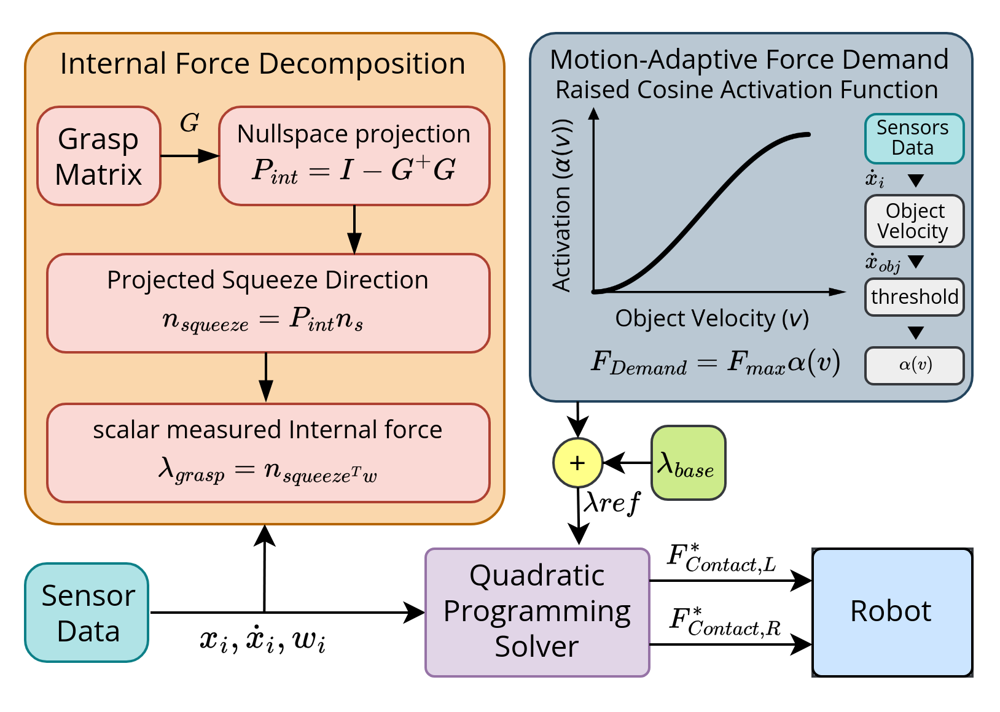
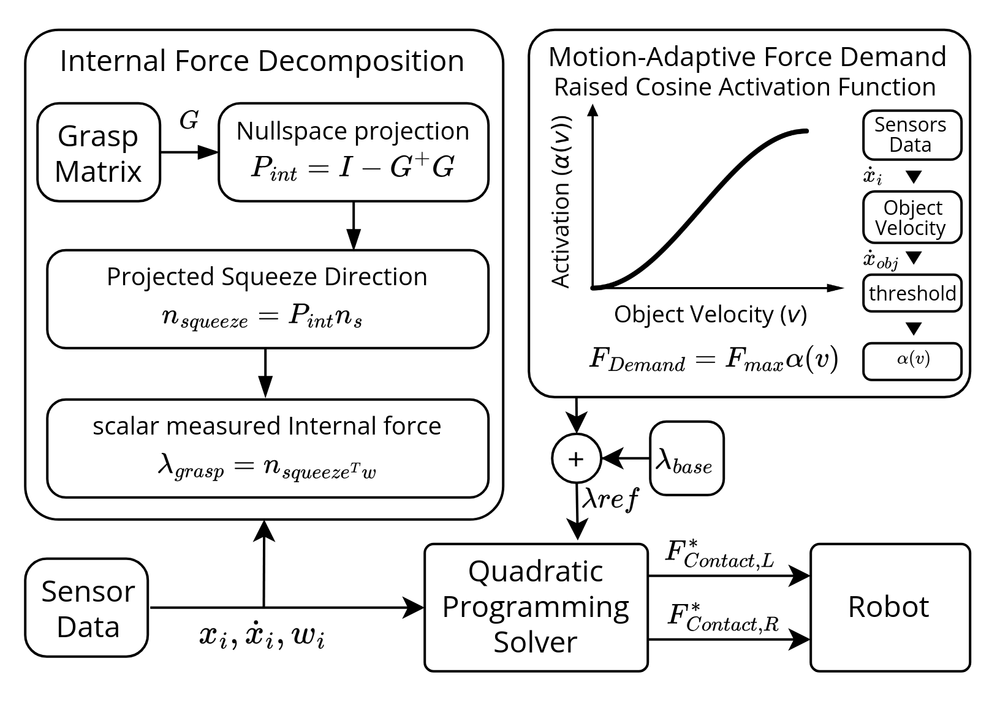

 Paper Revision
===================================

 
## Abstract

Cooperative dual-arm transport requires contact forces that simultaneously produce the desired object wrench and maintain a stable grasp. While the external wrenches govern object motion, the internal components of the contact forces referred to here as the squeeze force provides the normal compression needed to prevent slip. Maintaining this force at a constant or overly conservative level, however, wastes actuation effort and may damage fragile objects.
Cooperative dual-arm transport requires sufficient normal contact forces to maintain a stable grasp throughout object manipulation. These forces generate an internal compressive, or squeeze, force that prevents slip. Excessively conservative squeeze force, however, waste actuation effort and increase the risk of damaging fragile objects.
We present a motion-adaptive force allocation framework using grasp-matrix nullspace projection to decouple internal squeeze from external task wrenches, isolating a scalar squeeze force coordinate affine in the per-arm normal force variables. A real-time two variable quadratic program (QP) allocates these forces to track a desired internal squeeze force while shaping how that force is distributed between the two manipulators through a joint-torque-weighted regularization term, subject to friction and actuation constraints. Mirroring human grip regulation, a task-on-demand scheme dynamically couples the minimum admissible squeeze force to the object's motion state, scaling safety margins during transit and relaxing them at rest.

## Introduction

Cooperative dual-arm manipulation enables the transport of large or heavy objects, requiring sufficient normal squeeze force to prevent slip under inertial disturbances without risking damage to fragile items. Mirroring human precision grip, which dynamically adapts grip-to-load force ratios via friction-dependent safety margins~\cite{westling1984factors}, this trade-off motivates scheduling the minimum squeeze force online rather than fixing it a priori.

Existing approaches address this trade-off only partially: cooperative methods typically optimize squeeze statically without motion-dependent targets~\cite{tarbouriech2022admittance, zhang2025coordinated, palmieri2025comprehensive}, motion and slip adaptive control remains reactive and restricted to single grippers~\cite{nazari2025bioinspired,nazari2024human}, and wrench-level formulations rarely incorporate individual arm actuation margins~\cite{nakamura1986inverse,ben2003generalized,zhang2026ensuring}. 

While prior work addresses these aspects individually, their integration into a unified framework remains limited. In particular, combining nullspace-based squeeze-force isolation with a proactive motion-derived force demand and QP-based force allocation has received relatively little attention.

To address this gap, we propose a motion-adaptive framework coupling minimum squeeze force to estimated object velocity. We posit that this task-on-demand scheme reduces average squeeze force and actuator effort, particularly at rest, without compromising slip security. Specifically, this paper contributes:

- A motion adaptive, force demand scheduler coupling the minimum squeeze force margin to the estimated object velocity, reducing squeeze effort without requiring trajectory timing information.
- A joint-torque-weighted force allocation term that exploits the non-uniqueness of the internal squeeze decomposition to reshape how the tracked internal force is split between the two manipulators, biasing it toward one arm without perturbing the internal force tracking objective itself.

## Related Work
### Internal/External Force Decomposition and QP Based Load Distribution
Decomposing a multi-arm contact wrench into internal and external components dates to classical hybrid two arm coordination~\cite{uchiyama1988symmetric}. Nahon and Angeles posed internal force minimization in cooperating manipulators as constrained optimization~\cite{nahon1992minimization}, later extended with explicit normal force constraints via nonlinear and quadratic programming~\cite{erhart2015internal}. Non squeezing internal distributions from a generalized inverse of the grasp matrix are known to be non unique, underscoring that the internal force objective is a design choice rather than a mathematical necessity, a point revisited in Section~\ref{sec:discussion}. At the system level, admittance  and QP based dual-arm cobot frameworks regulate the internal/external effort balance for safe bimanual interaction~\cite{tarbouriech2022admittance}, with hierarchical QP formulations extended to mobile and free floating dual-arm manipulation~\cite{su2026cooperative}.
### Motion and Slip Adaptive Grip Force Control
The biological grounding for coupling grip force to task state comes from Westling and Johansson's study showing that human precision grip modulates grip force with load force and a friction dependent safety margin~\cite{westling1984factors}. While trajectory modulation has been proposed as an alternative to grip force modulation for slip prevention~\cite{nazari2025bioinspired}, this paper adopts the inverse framing, treating squeeze force as adaptive and trajectory as given. Hand acceleration modulation also serves as a slip strategy~\cite{nazari2024human}, motivating a velocity or acceleration derived demand (Section~\ref{sec:motion_demand}). Furthermore, reactive slip control shows that allocation-aware force redistribution outperforms uniform force increases, which can disturb object pose~\cite{ayral2026reactive}.
### Joint Space Capacity Aware Allocation
Coupling force or motion allocation to joint actuation capacity is established in redundant and multi-arm systems, ranging from classical pseudoinverse torque allocation~\cite{nakamura1986inverse} to modern QP controllers with margin-aware cost terms~\cite{zhang2026ensuring}. This paper applies this principle to the dual-arm wrench-level squeeze allocator in Section~\ref{sec:qp}, using per-arm torque weighting to select among the multiple internal force distributions that yield the same tracked squeeze force, rather than to alter the tracked force itself.

## System Overview and Problem Statement
<figure>
  
  <figcaption>Overview of the motion-adaptive dual-arm cooperative manipulation framework, showing the data flow between the motion estimator, force demand scheduler, and the QP allocator.</figcaption>
</figure>

<figure>
  
  <figcaption>Overview of the motion-adaptive dual-arm cooperative manipulation framework, showing the data flow between the motion estimator, force demand scheduler, and the QP allocator.</figcaption>
</figure>

The system operates across three stages: grasp establishment, trajectory execution, and cooperative transport.

During every control cycle in the cooperative stage, the allocator developed in this paper determines the per arm normal forces

\[\begin{equation}
\mathbf{x} =
\begin{bmatrix}
F_{n,L} & F_{n,R}
\end{bmatrix}^{\!\top}
\end{equation}\]

that (i) track a desired internal squeeze force, (ii) satisfy contact friction and actuation limits, (iii) default to a symmetric load balance between arms, and (iv) allow that balance to be reshaped through per-arm joint-torque weighting. The paper then details the internal wrench decomposition (Section~\ref{sec:decomposition}), motion-adaptivesqueeze force scheduling (Section~\ref{sec:motion_demand}), and the QP solver for $\mathbf{x}$ per cycle.

Central to requirat some interior pointement (i) is the choice of desired internal squeeze force itself, which in turn hinges on how the associated safety margin is defined. A constant safety margin ignores the object's motion state: remaining unnecessarily conservative at rest, wasting energy and contact pressure, while failing to tighten when transport dynamics increase slip risk. We instead design a force demand $F_{\mathrm{demand}}$ that grows with motion and relaxes at rest, subject to four requirements:

- **Zero at rest**: no added margin when the object is stationary.
- **Smoothness**: continuously differentiable evolution during motion.
- **Boundedness**: saturates at a configurable maximum.
- **Generality**: driven by measurements alone, independent of any trajectory generator.

## Internal Wrench Decomposition and Squeeze Isolation
### System Wrench and Grasp Matrix
The combined contact wrench applied by the two end-effectors is stacked into a single twelve dimensional vector

\[
\begin{equation}
w =
\begin{bmatrix}
w_L & w_R
\end{bmatrix}^{\top}
\in \mathbb{R}^{12},
\end{equation}
\]
where $w_L=[\tau_L,f_L]^{\top}$ and $w_R=[\tau_R,f_R]^{\top}$ denote the moment and force components at the left and right contacts. The grasp matrix $G\in\mathbb{R}^{6\times12}$ maps these contacts wrenches to the net object wrench, with its nullspace containing the internal wrenches that produce no net effect. The corresponding orthogonal projector onto this nullspace is
\[
\begin{equation}
P_{\mathrm{int}} = I_{12} - G^{\dagger}G,
\end{equation}
so that the self equilibrated internal component of the contact wrench is
\begin{equation}
w_{\mathrm{int}} = P_{\mathrm{int}}\,w.
\end{equation}
\]

### Squeeze Subspace Isolation
Not all internal wrenches constitute meaningful squeeze actions; only those along a kinematically valid direction do. Let $N$ denote the orthonormal basis for the nullspace of the grasp matrix $G$, obtained via singular value decomposition. Because a specified nominal squeeze direction $n_s$ may not inherently lie within the null subspace, we project it onto the nullspace basis and renormalize it to guarantee physical consistency, yielding the realizable squeeze direction:
\[
\begin{equation}
n_{\mathrm{squeeze}}
=
\frac{N N^{T} n_s}
{\left\lVert N N^{T} n_s \right\rVert}.
\end{equation}    
\]

### Scalar Grasp Force    
The scalar grasp (squeeze) force is defined as the projection of the internal wrench onto this direction,
\[
\lambda_{\mathrm{grasp}}
= n_{\mathrm{squeeze}}^{T} w_{\mathrm{int}}
= n_{\mathrm{squeeze}}^{T} P_{\mathrm{int}}\, w.
\end{equation}
\]
Because $n_{\mathrm{squeeze}}$ lies in the nullspace of $G$, it is invariant under $P_{\mathrm{int}}$, i.e., $P_{\mathrm{int}} n_{\mathrm{squeeze}} = n_{\mathrm{squeeze}}$; and because $P_{\mathrm{int}}$ is an orthogonal projector, it is symmetric, $P_{\mathrm{int}}^{T} = P_{\mathrm{int}}$. These two properties simplify the squeeze force expression to
\[
\begin{equation}
\lambda_{\mathrm{grasp}}
= \left(P_{\mathrm{int}} n_{\mathrm{squeeze}}\right)^{T} w
= n_{\mathrm{squeeze}}^{T} w,
\end{equation}  
\]
showing that $\lambda_{\mathrm{grasp}}$ depends only on the internal component of $w$: any wrench component associated with the object's motion is, by construction, orthogonal to $n_{\mathrm{squeeze}}$ and does not contribute to it.

### Decomposing $w$ into Fixed and Optimized Parts
To expose the squeeze force as an explicit function of the decision variables, the total contact wrench is decomposed as

\[
\begin{equation}
w = w_{\mathrm{0}} + S_n x,
\end{equation}    
\]
where \(w_{\mathrm{0}}\) collects the measured, non optimized contact moments and tangential forces, and \(S_n \in \mathbb{R}^{12 \times 2}\) maps the decision variables to the world frame normal force wrench components through the unit contact normals \(\hat{u}_L\) and \(\hat{u}_R\).
\[
\begin{align}
S_n =
\begin{bmatrix}
0_{3\times1} & \hat{u}_L & 0_{3\times1} & 0_{3\times1} \\
0_{3\times1} & 0_{3\times1} & 0_{3\times1} & \hat{u}_R
\end{bmatrix}^{T}
\end{align}
\]

Substituting into \(\lambda_{\mathrm{grasp}} = n_{\mathrm{squeeze}}^{T} w\) yields the affine squeeze force model

\[
\begin{align}
c^{T}_i &= n_{\mathrm{squeeze}}^{T} S_{n,i},
\\
\lambda_{0} &= n_{\mathrm{squeeze}}^{T} w_{\mathrm{0}}.
\end{align}
\]

where $c_i^T$ with $i\in\{L,R\}$.
denotes the block components of the coefficient vector corresponding to the left and right manipulators, partitioned according to the columns of $S_n =[S_{n,L},S_{n,R}]$ that map to each arm's decision variables. Thus, the coefficients $c_L$ and $c_R$ quantify the contribution of unit normal forces from the left and right manipulators, respectively, to the internal squeeze force, while $\lambda_0$ accounts for the squeeze generated by contact moments and tangential forces.

## Motion Adaptive Force Demand

### Velocity Based Motion Index

Several candidate motion indicators were evaluated. Acceleration relates directly to inertial loading, but for any smooth point-to-point motion the object accelerates and then decelerates, so acceleration necessarily reverses sign at least one interior point of the trajectory. Because only the magnitude of motion matters for the margin, this sign reversal must be discarded, e.g. by taking $∣a(t)∣$ but this maps the reversal into a non-differentiable minimum in the acceleration magnitude, splitting the profile into two lobes joined by a kink at exactly the instant the object is moving fastest. Translational velocity was selected instead because it is unimodal for typical point-to-point motions, varies smoothly throughout, and vanishes only at the trajectory endpoints. Because velocity is obtained directly from robot measurements, the resulting scheduler is measurement-driven and independent of trajectory timing or planner-specific details.

The estimated object translational velocity is computed as the average of the measured end-effector linear velocities,

\[
\begin{align}
v_{\mathrm{obj}}
=
\frac{1}{2}
\left(
\dot{x}_L+\dot{x}_R
\right),
\end{align}
with magnitude
\begin{align}
v
=
\left\|
v_{\mathrm{obj}}
\right\|.
\end{align}
\]

To prevent sensor noise and low amplitude oscillations from spuriously activating the adaptive force, a deadband is applied,

\[
\begin{align}
v_{\mathrm{eff}}
=
\max\left(0,\,
v-v_{\mathrm{db}}
\right),
\end{align}
\]

where $v_{\mathrm{db}}$ is the velocity threshold below which the object is considered stationary.

### Raised Cosine Force Scheduling

Instead of scaling demanded force linearly with velocity, a raised cosine activation function provides a smooth, continuously differentiable transition from zero to one with natural saturation at the maximum limit. A shape parameter adjusts the activation profile for earlier or later force buildup, while velocity-based activation keeps the formulation independent of the trajectory generator.
The normalized velocity is first computed as

\[
\begin{align}
z
=
\mathrm{clip}
\left(
\frac{v_{\mathrm{eff}}}{\delta},
0,
1
\right),
\end{align}
\]

where $\delta$ is the activation threshold velocity at which the adaptive force reaches its maximum. The motion activation coefficient is then given by the raised cosine function

\[
\begin{align}
\alpha(v)
=
\frac{1}{2}
\left(
1-
\cos
\left(
\pi z^k
\right)
\right),
\end{align}
\]

with $k>0$ controlling the curvature of the transition, and the motion adaptive force demand is

\[
\begin{align}
F_{\mathrm{demand}}
=
F_{\max}\,
\alpha(v),
\end{align}
\]

where $F_{\max}$ denotes the upper saturation limit defining the maximum allowable increment for the internal force contribution. This scheduled demand is subsequently combined with a baseline internal force reference to formulate the tracking constraints, a structure that will be detailed further in the \ref{sec}.
Fig.~\ref{fig:activation} illustrates the activation profile for different $k$. The demanded force increases smoothly from zero as motion begins and approaches $F_{\max}$ as velocity reaches $\delta$, improving grasp stability while avoiding discontinuities;
the deadband suppresses modulation from small velocity fluctuations, while $\delta$ and $k$ set the scheduler's operating range and sensitivity for straightforward tuning.

\begin{figure}[htbp]
\centerline{\includegraphics[width=0.85\columnwidth]{imgs/Activation.png}}
\caption{Evolution of the activation function for different values of the shape parameter $k$. As the object begins moving, the demanded force increases smoothly from zero, gradually approaching $F_{\max}$ as the velocity reaches the characteristic value $\delta$.}
\label{fig:activation}
\end{figure}

# QP Formulation for Squeeze Force Optimization
## Cost Function

The squeeze force allocation problem is cast as a real-time, two variable quadratic program with cost

\[
\begin{equation}
\begin{aligned}
J(x)
=\;
&\alpha\big(\lambda_{\mathrm{grasp}}(x)-\lambda_{\mathrm{reference}}(t)\big)^2
+\beta\,(F_{n,L}-F_{n,R})^2 \\
&+\gamma_L\lVert\tau_{c,L}(x)\rVert^2
+\gamma_R\lVert\tau_{c,R}(x)\rVert^2,
\end{aligned}
\label{eq:cost_full}
\end{equation}
with $\alpha,\beta,\gamma_L,\gamma_R>0$, and reference
\begin{equation}
\lambda_{\mathrm{reference}}(t) = \lambda_{\mathrm{base}} + F_{\mathrm{demand}}\big(v(t)\big),
\label{eq:lambda_ref}
\end{equation}  
\]

where $\lambda_{\mathrm{base}}$ is a constant internal force baseline ensuring nominal non-slip, and $F_{\mathrm{demand}}(v)$ is the motion-adaptive term from Sec.~\ref{sec:motion_demand}.
In the present implementation, $\lambda_{\mathrm{base}}$ and $F_{\max}$ are both tuned to keep the commanded squeeze comfortably above friction constraints.

Each term in \eqref{eq:cost_full} serves a distinct purpose. The first drives $\lambda_{\mathrm{grasp}}(x)$ toward $\lambda_{\mathrm{reference}}(t)$. Tracking above the friction-derived lower bound is deliberate: minimizing $\lambda_{\mathrm{grasp}}$ directly would push the optimum onto the boundary, rendering the torque-aware terms ineffective. Tracking above it gives the optimizer slack to balance squeeze force against joint torque while satisfying motion-dependent demand. The second term, $\beta(F_{n,L}-F_{n,R})^2$, prevents load asymmetry between arms. The final two terms penalize joint torques $\tau_{c,L}(x)=J_L^{T}w_L$ and $\tau_{c,R}(x)=J_R^{T}w_R$ at the contact wrenches.

## QP Derivation

Because $\lambda_{\mathrm{grasp}}(x)$, $F_{n,L}-F_{n,R}$, and $\tau_{c,L}(x),\tau_{c,R}(x)$ are all affine in $x$, each of the four terms in \eqref{eq:cost_full} is a quadratic function of $x$, and their sum reduces to the standard form objective $J(x) = \tfrac{1}{2}x^THx + g^Tx$. The following three steps expand each cost term in turn and collect its contribution to $H$ and $g$.

### Squeeze force tracking

Substituting the affine squeeze force model of Section~\ref{sec:decomposition} and the reference \eqref{eq:lambda_ref} into the tracking error gives

\[
\begin{align}
    \lambda_{\mathrm{grasp}}(x) - \lambda_{\mathrm{reference}}(t) &= c^Tx + \tilde\lambda_0(t), \\ 
    \tilde\lambda_0(t) :&= \lambda_0 - \lambda_{\mathrm{reference}}(t),
\end{align}
\]

where $\tilde\lambda_0$ absorbs into a single time varying offset both the fixed contact contribution $\lambda_0$ and the motion adaptive reference. The first term of \eqref{eq:cost_full} then expands to

\[
\begin{align}
    \big(\lambda_{\mathrm{grasp}}(x)-\lambda_{\mathrm{reference}}(t)\big)^2 = \,x^T(cc^T)x + 2\tilde\lambda_0\,c^Tx + \tilde\lambda_0^2,
\end{align}  
\]

of which only the first two, $x$ dependent terms contribute to $H$ and $g$.

### Load balancing

With $d = [1,\,-1]^T$, the imbalance $F_{n,L}-F_{n,R} = d^Tx$ is itself linear in $x$, so the second term of \eqref{eq:cost_full} is already a homogeneous quadratic form,

\[
\begin{align}
    (F_{n,L}-F_{n,R})^2 = \,x^T(dd^T)x = x^T\begin{bmatrix} 1 & -1 \\ -1 & 1 \end{bmatrix} x,
\end{align}  
\]

which contributes to $H$ alone.

### Joint-torque-weighted regularization

Recall from Section~\ref{sec:decomposition} that the total contact wrench decomposes as $w = w_0 + S_nx$, with $S_n=\mathrm{blkdiag}(S_{n,L},S_{n,R})$ block diagonal across the two arms; each manipulator's commanded wrench therefore depends only on its own decision variable,

\[
\begin{align}
w_L = w_{0,L} + S_{n,L}F_{n,L}, \qquad w_R = w_{0,R} + S_{n,R}F_{n,R}.
\end{align}
\]

Mapping through the arm Jacobians, $\tau_{c,i}(x)=J_i^Tw_i$ for $i\in\{L,R\}$, preserves this decoupling and yields affine, per arm torque maps,

\[
\begin{align}
    \tau_{c,L}(x) &= \tau_{f,L} + b_LF_{n,L}, & b_L &= J_L^TS_{n,L}, & \tau_{f,L} &= J_L^Tw_{0,L}, \\
    \tau_{c,R}(x) &= \tau_{f,R} + b_RF_{n,R}, & b_R &= J_R^TS_{n,R}, & \tau_{f,R} &= J_R^Tw_{0,R}.
\end{align}
\]

Because $\tau_{c,L}$ depends only on $F_{n,L}$ and $\tau_{c,R}$ only on $F_{n,R}$, the last two terms of \eqref{eq:cost_full} expand without cross terms between the arms,

\[
\begin{align}
\lVert\tau_{c,i}(x)\rVert^2
&= \lVert b_i\rVert^2 F_{n,i}^2
   + 2(\tau_{f,i}^Tb_i)F_{n,i} + \lVert\tau_{f,i}\rVert^2,\notag\\
&i \in \{L,R\}.
\end{align}  
\]

so the torque terms will only ever populate the diagonal of $H$.

## Assembled QP

Collecting the $x$ dependent contributions of the three terms above into $J(x)=\tfrac{1}{2}x^THx+g^Tx$ gives

\[
\begin{align}
    H = \begin{bmatrix}H_{11}&H_{12}\\H_{12}&H_{22}\end{bmatrix}, \qquad g = [g_L,\ g_R]^T,
\end{align}
\]

\[
\begin{align}
    H_{11} &= 2\big(\alpha c_L^2 + \beta + \gamma_L\lVert b_L\rVert^2\big), \\
H_{22} &= 2\big(\alpha c_R^2 + \beta + \gamma_R\lVert b_R\rVert^2\big),\\
H_{12} &= 2\big(\alpha c_Lc_R - \beta\big),\\
g_L &= 2\big(\alpha\tilde\lambda_0 c_L + \gamma_L\,\tau_{f,L}^Tb_L\big),\\
g_R &= 2\big(\alpha\tilde\lambda_0 c_R + \gamma_R\,\tau_{f,R}^Tb_R\big).
\end{align}
\]

Because $H$ is formed by positive semidefinite terms, we have $H \succ 0$ for any $\alpha,\beta,\gamma_L,\gamma_R>0$, ensuring a strictly convex objective regardless of tuning weights. This positive definiteness guarantees a unique global minimum, which is solved efficiently each cycle within the box constraints.

## Constraints

The decision variables are signed contact normal forces: negative denotes compression along the inward contact normal (squeezing),  values closer to zero denote a lighter grasp. Under this convention more negative means greater compression, so the minimum compression required to prevent slip becomes an \emph{upper} bound on $x$, while the actuation limit becomes a \emph{lower} bound.

The upper bound follows from the Coulomb friction limit at each contact, using the measured tangential force component,

\[
\begin{align}
x_u^L(t) &= -\frac{|F_{t,L}(t)|}{\mu} - \epsilon, \label{eq:friction_bound_L}\\
x_u^R(t) &= -\frac{|F_{t,R}(t)|}{\mu} - \epsilon, \label{eq:friction_bound_R}
\end{align}
\]

where $F_{t,L},F_{t,R}$ are the measured tangential force components, $\mu$ is the friction coefficient (assumed identical for both arms, though per-arm $\mu_L,\mu_R$ is a straightforward extension), and $\epsilon\ge0$ is a fixed safety margin. $F_{t,L}$ and $F_{t,R}$ are taken from the current sensor sample.

The lower bound $x_l$ is a fixed, conservative actuation floor common to both arms, independent of the sensed tangential force. The resulting box constraints are

\[
\begin{align}
x_l &\le F_{n,L} \le x_u^L(t), \label{eq:box_L}\\
x_l &\le F_{n,R} \le x_u^R(t). \label{eq:box_R}
\end{align}
\]

# Experimental Validation

## Protocol
The framework is evaluated on the dual xArm7 platform described in Section~\ref{sec:system_overview}, executing a pick carry place trajectory. Two force demand conditions are compared: (a) a constant baseline force $F_{\mathrm{static}}$, and (b) a motion estimated $F_{\mathrm{demand}}$ computed online from the measured object velocity.

## Results
The experiments were designed to evaluate whether the proposed force on demand controller can reduce power and energy consumption while providing comparable internal squeeze force to a constant force strategy during object motion. In particular, the comparison was designed to avoid the trivial case in which a lower constant squeeze force would naturally result in lower power consumption. Therefore, the constant force and force on demand controllers were tuned under the same task conditions and applied to the same trajectories, with comparable internal squeeze force during the moving portions of the task. The difference between the two strategies is thus primarily related to how the internal squeeze force is applied throughout the motion cycle. The constant force baseline maintains the selected internal force throughout the task, whereas the force on demand controller modulates the force according to the object's motion state, increasing the force when it is required for motion and reducing it when the higher force is not required. Since the force on demand profile is defined through a raised cosine function, its thresholds, maximum force, and deadband can be tuned to regulate the force according to the motion condition, including low-speed operation.

Fig.~\ref{fig:trajectory_single} reports the object's kinematics during a representative pick carry place cycle: (a) trajectory, (b) velocity profile. Fig.~\ref{fig:force_single} compares the desired and measured internal squeeze force for the proposed force on demand controller and the constant force baseline over the same trajectory cycle. The force profiles show that comparable squeeze force are provided during motion, while the force on demand controller modulates the internal force according to the motion state rather than maintaining the same force throughout the complete cycle. The corresponding power and energy characteristics are summarized in Table~\ref{tab:power_single} including Root mean Square (RMS), standard deviation, maximum, and minimum values.. 

To investigate whether the observed behavior is maintained over repeated operation, Fig.~\ref{fig:trajectory_five} and Fig.~\ref{fig:force_five}repeat the comparison over five consecutive cycles of a two waypoint trajectory. This experiment extends the single-cycle evaluation to repeated duty cycles and provides a more representative assessment of the power and energy implications of the proposed strategy for continuous or repetitive operation. The aggregate power and energy statistics are reported in Table~\ref{tab:power_five}. 

Across both experiments, the force on demand controller reduces RMS and peak power draw and total energy consumption relative to the constant force baseline, while maintaining comparable internal  during motion. These results demonstrate that coupling the squeeze force reference to the object's motion state can reduce actuation effort by avoiding the continuous application of the higher internal force throughout the entire duty cycle, while preserving the required squeeze force when it is needed for object motion.

\begin{table}[htbp] 
\caption{Power statistics and energy consumption for the single cycle experiment} 
\label{tab:power_single} 
\centering 
\footnotesize 
\setlength{\tabcolsep}{3pt} 
\begin{tabular}{|p{2.2cm}|c|c|c|c|c|}
\hline 
\textbf{Experiment} & \multicolumn{4}{c|}{\textbf{Power Statistics [W]}} & \textbf{Energy [J]} \\ 
\cline{2-5} 
& \textit{RMS} & \textit{Std} & \textit{Max} & \textit{Min} & \\ 
\hline 
Constant Forces \newline \textit{(Baseline)} & 17.50 & 6.39 & 26.22 & 6.46 & 659.72 \\ 
\hline 
\makecell[l]{Force On Demand \\ \textit{(Proposed)}} & 
\makecell{15.04 \\ \scriptsize\textbf{(-14.1\%)}} & 
\makecell{4.99 \\ \scriptsize\textbf{(-21.9\%)}} & 
\makecell{23.52 \\ \scriptsize\textbf{(-10.3\%)}} & 
\makecell{5.41 \\ \scriptsize\textbf{(-16.3\%)}} & 
\makecell{569.02 \\ \scriptsize\textbf{(-13.7\%)}} \\ 
\hline 
\multicolumn{6}{l}{\scriptsize Values in parentheses: Percentage reduction of Proposed method relative to Baseline.} 
\end{tabular} 
\end{table}

## Joint-Torque-Weighted Force Allocation
\label{sec:torque_weighting_results}

A second set of experiments isolates the effect of the torque weights ($\gamma_L$) and ($\gamma_R$) on the internal-force distribution while keeping the force demand, friction constraints, trajectory, and all other QP parameters fixed. Under symmetric weighting, ($\gamma_L=\gamma_R$), the two normal-force trajectories are numerically identical and therefore overlap throughout Fig.~\ref{fig:torque_weighting}(a). This symmetric allocation is consistent with the formulation, in which the grasp-force mapping satisfies ($ c_L=c_R $).

When asymmetric weights are applied, ($\gamma_L\neq\gamma_R$), the optimizer produces an asymmetric allocation of the internal force between the two manipulators, while the achieved grasp-force trajectory remains unchanged in the experiment. Importantly, the effect of the torque weights is not equivalent to simply assigning less force to the more heavily weighted arm. The preferred allocation depends on the instantaneous manipulator configuration, Jacobians, fixed contact wrench, and the other terms and constraints of the QP; consequently, the arm carrying the larger share of the internal force may change along the trajectory, as observed in Fig.~\ref{fig:torque_weighting}(b). The torque regularization is projected onto the nullspace of the grasp-force mapping, ($P=nn^T$) with ($c^Tn=0$), so that it directly acts on the force-redistribution degree of freedom rather than on the total grasp-force direction. Thus, for the tested trajectory and fixed friction constraints, varying ($\gamma_L$) and ($\gamma_R$) redistributes the internal force between the manipulators without changing the achieved grasp force, while all contact forces remain within their friction-cone bounds.

## Conclusion and Future Work

This paper introduced a motion-adaptive squeeze force allocation framework for cooperative dual-arm manipulation using internal wrench decomposition and a lightweight quadratic program. By combining task-dependent grasp force scheduling with torque-aware load redistribution, the method adapts squeeze forces online while maintaining stability.

The formulation includes a joint-torque-weighted regularization term that biases internal force allocation toward one manipulator while preserving internal force tracking and satisfying friction-cone constraints. Experiments in Section~\ref{sec:torque_weighting_results} show that symmetric weighting produces an even force split for kinematically symmetric arms, while asymmetric weighting redistributes the per-arm load without affecting the tracked internal force. This enables allocation based on actuation capability. Future work will derive these weights automatically from online torque margin estimates.

An important aspect of the proposed formulation is that the contact forces are related to the object-level wrench through the grasp matrix. Although the quadratic program directly optimizes the contact forces rather than explicitly optimizing the object moment, the grasp matrix accounts for the moment generated by the spatial offsets between the contact points and the object reference point, here defined at the object center of mass. Consequently, the formulation is not restricted to purely translational object motion. In the case of rotational object motion, the corresponding end-effector motion becomes a general roto-translational motion, and the proposed framework can accommodate this motion through the grasp kinematics and the measured end-effector velocities. While rotational motion was not explicitly evaluated in the experiments presented in this work, this formulation provides a natural basis for extending the proposed force allocation strategy to manipulation tasks involving simultaneous translation and rotation of the object.

Experiments on a dual xArm7 platform demonstrated secure transport while significantly reducing unnecessary internal forces. Compared with a constant-force baseline, the controller achieved up to 16\% lower energy consumption and about 15\% lower RMS power, demonstrating improved energetic efficiency without compromising robustness. Future work will investigate the proposed framework under more general six-degree-of-freedom object motions, including tasks involving significant object rotation, to experimentally evaluate the interaction between force redistribution, object moments, and rotational motion.

